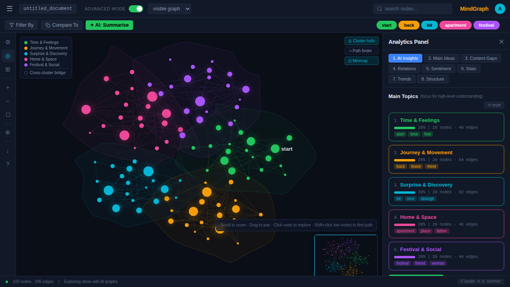
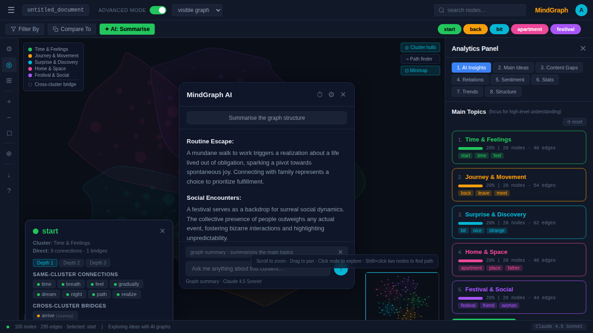
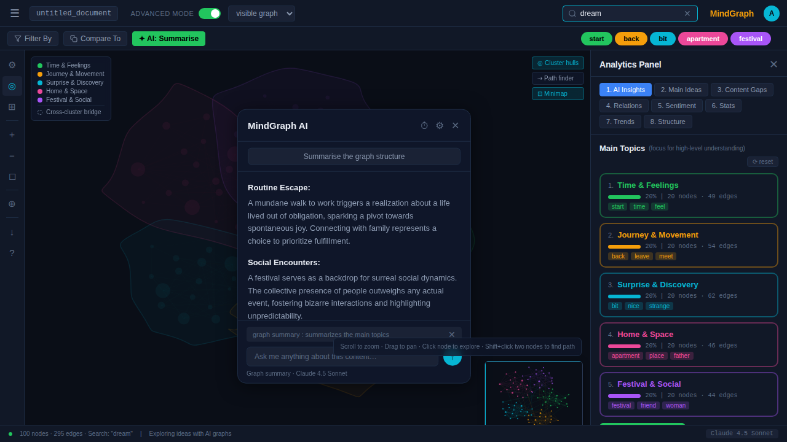
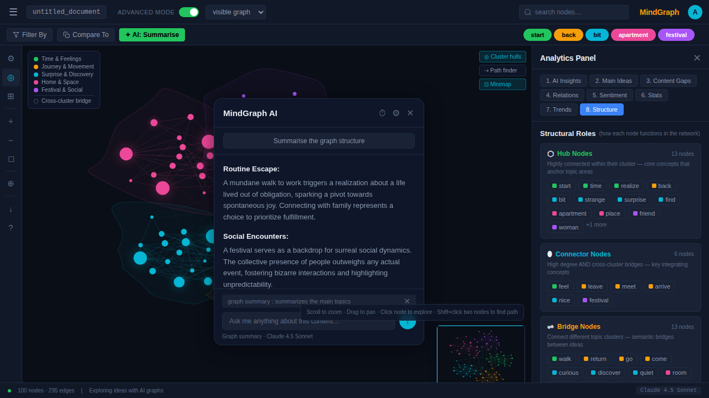

# MindGraph

**Network text analytics visualization tool.** Explore ideas as an interactive force-directed graph with cluster analysis, path finding, sentiment analysis, and analytics dashboards.

Zero runtime dependencies. 66 KB production bundle. Pure vanilla JavaScript + Canvas 2D.



---

## Features

- **Force-directed graph** — Canvas 2D physics simulation with zoom, pan, and fly-to animations
- **Cluster analysis** — Automatic topic clustering with convex hull overlays and color coding
- **Path finder** — BFS shortest path between any two nodes with animated particles
- **Node explorer** — Click any node to see connections, bridges, and depth traversal
- **Minimap** — Draggable viewport overview
- **8 analytics tabs** — AI Insights, Main Ideas, Content Gaps, Relations, Sentiment, Stats, Trends, Structure
- **AI chat panel** — Floating conversational interface (UI mockup)
- **Search & filter** — Real-time node search with cluster filter pills

### Node Selection & Detail

Click any node to inspect its connections, cross-cluster bridges, and neighborhood at configurable depth (1-3 hops).



### Search & Cluster Filtering

Type to search nodes in real-time. Use cluster pills to filter by topic. Non-matching nodes fade out while the graph layout is preserved.



### Analytics Dashboard

Eight analytics tabs provide network metrics, sentiment analysis, content gap detection, and structural analysis — all computed client-side from the graph data.



---

## Quick Start

```bash
npm install        # Install dev dependencies
npm run build      # Bundle src/ → dist/ (JS 42KB + CSS 24KB)
open index.html    # Open in browser
```

## Development

```bash
npm run dev            # Watch mode (rebuilds on change)
npm run lint           # ESLint
npm run lint:fix       # ESLint with auto-fix
npm run format         # Prettier
npm run typecheck      # TypeScript checkJs (no emit)
npm run test           # Vitest unit tests (35 tests)
npm run test:e2e       # Playwright E2E smoke tests (8 tests)
npm run check          # Full CI check (lint + typecheck + test + build)
```

For development without rebuilding, edit `index.html` to load source directly:

```html
<link rel="stylesheet" href="src/css/bundle.css">
<script type="module" src="src/js/app.js"></script>
```

---

## Architecture

```
src/
├── js/
│   ├── app.js              # Entry point & render loop
│   ├── core/               # Data layer & algorithms
│   │   ├── state.js        # Centralized mutable state
│   │   ├── config.js       # Constants, physics params, seeded PRNG
│   │   ├── graph-data.js   # Node/edge generation
│   │   ├── physics.js      # Force-directed simulation
│   │   ├── camera.js       # Canvas transforms & fly-to
│   │   ├── geometry.js     # Convex hull & splines
│   │   └── pathfinding.js  # BFS shortest path
│   ├── ui/                 # Rendering & interaction
│   │   ├── renderer.js     # 6 rendering passes
│   │   ├── interaction.js  # Mouse/keyboard events
│   │   ├── state-actions.js # Node selection & depth
│   │   ├── panels.js       # Analytics panel & node detail
│   │   ├── minimap.js      # Minimap rendering
│   │   └── search.js       # Search & cluster filter
│   └── analytics/
│       └── tabs.js         # 8 analytics tab builders
├── types/                  # TypeScript declarations
│   ├── graph.d.ts          # GraphNode, GraphEdge, AppState
│   └── global.d.ts         # Window augmentation
└── css/                    # 10 stylesheet files
    ├── bundle.css          # Entry point
    ├── variables.css       # Design tokens
    └── ...                 # Component styles
```

**Data flow:** `config.js` → `graph-data.js` → `physics.js` (simulate) → `renderer.js` (draw) → Canvas 2D, with `interaction.js` handling input → `state.js` mutations → re-read each frame.

---

## Tech Stack

| Layer | Technology |
|---|---|
| Language | JavaScript ES Modules |
| Rendering | Canvas 2D API |
| Styling | CSS3 + Custom Properties |
| Build | esbuild |
| Type Checking | TypeScript (checkJs, no emit) |
| Unit Tests | Vitest (35 tests) |
| E2E Tests | Playwright (8 smoke tests) |
| Linting | ESLint + Prettier |
| Runtime Dependencies | **None** |

## Bundle Size

| File | Size |
|---|---|
| `mindgraph.min.js` | 42 KB |
| `mindgraph.min.css` | 24 KB |
| `index.html` | 8 KB |
| **Total** | **~74 KB** |

---

## Tests

```bash
npm run test           # 35 unit tests (geometry, pathfinding, analytics)
npm run test:coverage  # Unit tests with coverage
npm run test:e2e       # 8 Playwright smoke tests with screenshots
```

Unit tests cover pure functions: `convexHull`, `expandHull`, `bfsPath`, `getNeighborsAtDepth`, `wordSentiment`, `computeDegrees`, `computeGraphDensity`, `computeClusteringCoeff`, `computeBridgeScore`.

E2E tests verify page load, canvas rendering, node selection, search filtering, analytics tabs, and path mode.

---

## License

ISC
